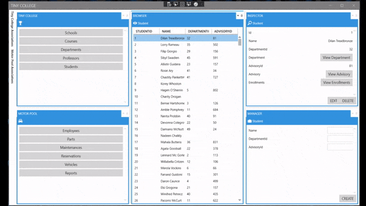

# TinyCollege
C#/WPF/MvvmCross/EntityFramework/SQL/AvalonDock/MahApps.Metro

## Description

Using the techstack, TinyCollege is an example of a Desktop CRUD App

## Preview

## How to run
1. build TinyCollege.Data in Vscode
2. Configure context connectionstring in TinyCollege.Data/Models/TinyCollegeContext.cs and TinyCollege.Service/BaseService.cs with your SQLServer
3. In Vscode>package manager console - run `update-database`
4. run TinyCollege.Wpf

## Acknowledgments
* [MvvmCross for WPF: A Basic Primer](https://www.codeproject.com/Articles/5273075/MvvmCross-for-WPF-A-Basic-Primer)
* [IAmTimCorey](https://www.youtube.com/watch?v=8E000zu8UhQ)
* [wpftoolkit](https://github.com/xceedsoftware/wpftoolkit)
* [MahApps.Metro](https://mahapps.com/)
